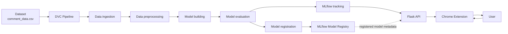

# YouTube Viewer Sentiment Analysis (MLOps)

YouTube Viewer Sentiment Analysis is an end-to-end MLOps system that collects YouTube comments through a Chrome extension, classifies each comment as positive, neutral, or negative using a trained LightGBM model, and displays the analysis in the extension popup. The application provides sentiment distribution, a word cloud, a sentiment trend graph, and summary metrics for the analyzed comments.

## Architecture and Flow



The offline workflow uses DVC to execute the data and model stages. MLflow records experiment parameters, metrics, artifacts, and the registered model. The online workflow uses the Flask API and local serialized model files for live inference. The Chrome extension fetches comments from YouTube, sends them to the Flask API, and renders the returned predictions and visualizations for the user.

## Tech Stack

- **Python**
- **pandas** and **NumPy** for data preparation
- **scikit-learn TF-IDF** for text feature extraction
- **LightGBM** for multiclass sentiment classification
- **NLTK** for stopword removal and lemmatization
- **MLflow** for experiment tracking and model registration
- **DVC** for data and pipeline versioning
- **Flask** and **Flask-CORS** for the prediction API
- **matplotlib** and **seaborn** for charts and evaluation artifacts
- **wordcloud** for word-cloud generation
- **Chrome Extension Manifest V3**
- **YouTube Data API** for comment collection

## Dataset

The main dataset is [`dataset/comment_data.csv`](dataset/comment_data.csv). It contains:

| Column | Description |
|---|---|
| `clean_comment` | Comment text used for sentiment analysis |
| `category` | Sentiment label: `1` = positive, `0` = neutral, `-1` = negative |

[`dataset/reddit_preprocessing.csv`](dataset/reddit_preprocessing.csv) also exists in the repository, but it is not used by the main DVC pipeline.

## DVC Pipeline

The pipeline is defined in [`dvc.yaml`](dvc.yaml) and can be reproduced with:

```bash
dvc repro
```

The five stages are:

1. **`data_ingestion`** — Loads the labeled comment dataset, removes missing, duplicate, and empty records, and creates reproducible training and testing splits under `data/raw/`.
2. **`data_preprocessing`** — Normalizes comments by lowercasing text, removing unsupported characters and stopwords, preserving selected sentiment-related words, and applying lemmatization. It writes processed files under `data/interim/`.
3. **`model_building`** — Fits the TF-IDF vectorizer on the processed training data and trains the LightGBM multiclass classifier. It produces `tfidf_vectorizer.pkl` and `lgbm_model.pkl`.
4. **`model_evaluation`** — Evaluates the model on the processed test data, logs metrics and artifacts to MLflow, creates a confusion matrix, and writes `experiment_info.json`.
5. **`model_registration`** — Uses the MLflow run information to register the model as `yt_chrome_plugin_model` and transition the registered version to the Staging stage.

The pipeline parameters are defined in [`params.yaml`](params.yaml):

```yaml
data_ingestion:
  test_size: 0.20

model_building:
  ngram_range: [1, 3]
  max_features: 1000
  learning_rate: 0.09
  max_depth: 20
  n_estimators: 367
```

`dvc.lock` records the dependency and output hashes for a reproducible pipeline state.

## Setup

### 1. Clone the repository

```bash
git clone https://github.com/Gireesh-Kumar-Gowd/YouTube-Viewer-Sentiment-Analysis-End-to-End-MLOps-Pipeline.git
cd YouTube-Viewer-Sentiment-Analysis-End-to-End-MLOps-Pipeline
```

### 2. Create and activate a virtual environment

Windows PowerShell:

```powershell
python -m venv .venv
.\.venv\Scripts\Activate.ps1
```

macOS/Linux:

```bash
python3 -m venv .venv
source .venv/bin/activate
```

### 3. Install the project

The editable install reads dependencies from [`requirements.txt`](requirements.txt) through [`setup.py`](setup.py):

```bash
pip install -e .
```

### 4. Run the complete DVC pipeline

```bash
dvc repro
```

This generates or refreshes the processed datasets, model files, evaluation information, and MLflow artifacts. The ingestion stage downloads the dataset from the configured raw GitHub URL, so network access is required when that stage runs.

### 5. Start the Flask backend

```bash
python flask_app/main.py
```

The API listens on `http://localhost:5000`.

### 6. Load the Chrome extension

1. Open `chrome://extensions` in Chrome.
2. Enable **Developer mode**.
3. Select **Load unpacked**.
4. Choose the [`yt-chrome-plugin-frontend/`](yt-chrome-plugin-frontend/) directory.
5. Open a YouTube video and select the extension.

## Flask API

The backend is implemented in [`flask_app/main.py`](flask_app/main.py). Unless otherwise noted, requests use JSON.

### `GET /`

Returns a basic API welcome message.

Response:

```text
Welcome to our flask api
```

### `POST /predict`

Predicts sentiment for an array of comment strings.

Request:

```json
{
  "comments": [
    "This video is excellent",
    "I did not like this video"
  ]
}
```

Response:

```json
[
  {
    "comment": "This video is excellent",
    "sentiment": 1
  },
  {
    "comment": "I did not like this video",
    "sentiment": -1
  }
]
```

### `POST /predict_with_timestamps`

Predicts sentiment for comment objects while preserving their timestamps for trend analysis.

Request:

```json
{
  "comments": [
    {
      "text": "This video is excellent",
      "timestamp": "2026-09-22T12:00:00Z",
      "authorId": "channel-id"
    }
  ]
}
```

Response:

```json
[
  {
    "comment": "This video is excellent",
    "sentiment": "1",
    "timestamp": "2026-09-22T12:00:00Z"
  }
]
```

### `POST /generate_chart`

Creates a sentiment-distribution pie chart and returns it as a PNG image.

Request:

```json
{
  "sentiment_counts": {
    "1": 20,
    "0": 10,
    "-1": 5
  }
}
```

Response: a PNG image containing the positive, neutral, and negative distribution.

### `POST /generate_wordcloud`

Creates a word cloud from comment text and returns it as a PNG image.

Request:

```json
{
  "comments": [
    "This is a great video",
    "Very helpful explanation"
  ]
}
```

Response: a PNG word-cloud image.

### `POST /generate_trend_graph`

Creates a monthly sentiment-percentage trend graph from timestamped predictions.

Request:

```json
{
  "sentiment_data": [
    {
      "timestamp": "2026-01-15T10:00:00Z",
      "sentiment": 1
    },
    {
      "timestamp": "2026-02-20T10:00:00Z",
      "sentiment": -1
    }
  ]
}
```

Response: a PNG line graph containing negative, neutral, and positive monthly percentages.

For invalid or missing input, the API returns a JSON error response with an appropriate HTTP status. Prediction and visualization failures are returned as HTTP 500 responses with an error description.

## Chrome Extension Usage

The extension is located in [`yt-chrome-plugin-frontend/`](yt-chrome-plugin-frontend/). [`manifest.json`](yt-chrome-plugin-frontend/manifest.json) defines the Manifest V3 extension and its popup, permissions, and API access. [`popup.html`](yt-chrome-plugin-frontend/popup.html) provides the popup layout, while [`popup.js`](yt-chrome-plugin-frontend/popup.js) controls the workflow.

When the popup opens, it reads the active browser tab and verifies that the page is a YouTube watch URL. It extracts the eleven-character video ID and calls the YouTube Data API `commentThreads` endpoint. It requests up to 100 comments per page and follows pagination until it collects up to 500 comments or there are no more pages. Each comment is retained with its text, timestamp, and author channel ID.

The extension sends the collected comments to `http://localhost:5000/predict_with_timestamps`. After receiving predictions, it calculates total comments, unique commenters, average comment word count, and a normalized sentiment score. It then calls the Flask visualization endpoints to display a sentiment pie chart, a monthly sentiment trend graph, and a word cloud. The popup also displays the first 25 analyzed comments with their predicted sentiments.

The YouTube API key is currently configured in `popup.js`. For public or production use, protect and restrict the key through the Google Cloud configuration appropriate for the extension.

## Project Structure

```text
.
├── dataset/
│   ├── comment_data.csv
│   └── reddit_preprocessing.csv
├── data/
│   ├── raw/
│   │   ├── train.csv
│   │   └── test.csv
│   └── interim/
│       ├── train_processed.csv
│       └── test_processed.csv
├── src/
│   └── youtubeViewerSentimentAnalysis/
│       ├── data/
│       │   ├── data_ingestion.py
│       │   └── data_preprocessing.py
│       ├── model/
│       │   ├── model_building.py
│       │   ├── model_evaluation.py
│       │   └── register_model.py
│       ├── exception.py
│       └── logger.py
├── flask_app/
│   └── main.py
├── yt-chrome-plugin-frontend/
│   ├── manifest.json
│   ├── popup.html
│   └── popup.js
├── notebooks/
│   ├── 1_Preprocessing_&_EDA.ipynb
│   ├── 2_experiment_1_baseline_model.ipynb
│   ├── 3_experiment_2_bow_tfidf.ipynb
│   ├── 4_experiment_3_tfidf_(1,3)_max_features.ipynb
│   └── 5_experiment_4_handling_imbalanced_data.ipynb
├── dvc.yaml
├── dvc.lock
├── params.yaml
├── requirements.txt
├── setup.py
├── lgbm_model.pkl
├── tfidf_vectorizer.pkl
└── experiment_info.json
```

## Notebooks

- [`1_Preprocessing_&_EDA.ipynb`](notebooks/1_Preprocessing_&_EDA.ipynb) — Dataset inspection, preprocessing, and exploratory data analysis.
- [`2_experiment_1_baseline_model.ipynb`](notebooks/2_experiment_1_baseline_model.ipynb) — Baseline model experiment.
- [`3_experiment_2_bow_tfidf.ipynb`](notebooks/3_experiment_2_bow_tfidf.ipynb) — Bag-of-words and TF-IDF feature experiments.
- [`4_experiment_3_tfidf_(1,3)_max_features.ipynb`](notebooks/4_experiment_3_tfidf_(1,3)_max_features.ipynb) — TF-IDF n-gram range and maximum-feature experiments.
- [`5_experiment_4_handling_imbalanced_data.ipynb`](notebooks/5_experiment_4_handling_imbalanced_data.ipynb) — Handling class imbalance during model development.

## Model Details

The model pipeline first applies the same text normalization steps during training and inference. The processed text is converted into numerical features by a TF-IDF vectorizer configured for unigrams through trigrams and a maximum of 1,000 features. A LightGBM multiclass classifier then predicts one of the three sentiment labels: `-1`, `0`, or `1`.

The TF-IDF vectorizer and LightGBM model must be used together. The vectorizer defines the vocabulary and feature ordering that the classifier learned during training, so using a different vectorizer or changing its configuration would produce incompatible model inputs.

MLflow tracks the evaluation run, parameters, metrics, model artifacts, vectorizer artifact, and confusion matrix. The model is registered under `yt_chrome_plugin_model`. Live inference currently loads the local [`lgbm_model.pkl`](lgbm_model.pkl) and [`tfidf_vectorizer.pkl`](tfidf_vectorizer.pkl) files rather than loading the model directly from the MLflow Model Registry.

## Roadmap

- Add Docker containerization. The root [`Dockerfile`](Dockerfile) is currently empty.
- Add a CI/CD pipeline for automated build, validation, and deployment.
- Use the MLflow Model Registry directly for live model loading instead of relying only on local `.pkl` files.

## License

License information will be added here.

## Contributing

Contribution guidelines will be added here. Until then, please open an issue to discuss a proposed change before submitting a pull request.
